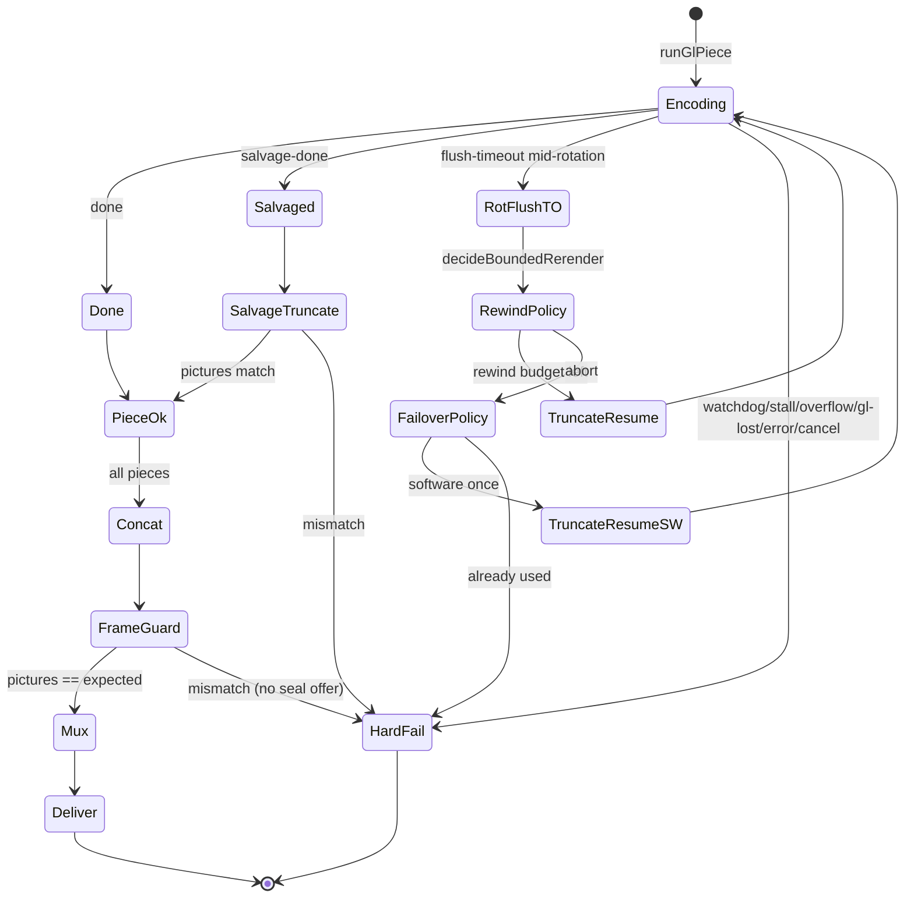

# WS3 — Export pipeline architecture audit (PROMPT 12)

> **Read-only.** No code, tests, refactors, or fixes were produced in this pass.
> **Date:** 2026-09-10.
> **Heads audited (not merged):**
> - `ws3-durable-resume` `81bde88` (`81bde8806db48736544ea9a670aef7b52d39aa05`) — Rust, sealing, resume primitives, bounds.
> - `ws3-tier3-failover` `dedc3bf` (`dedc3bfe6e9d3579fb321f75076afe8f8a645459`) — rewind, failover, throttling, batching.
> **Not consulted:** `ws3-tier2-wire` (or any merge of the two heads). Where the halves are unwired, this audit covers the *seam* — whether wiring *can* be correct, not how CC is wiring it.
>
> Citations are `file:line` against the named HEAD. Cross-references `docs/ws3-export-architecture-ledger.md` (Round 9 taxonomy, on `dedc3bf`) and `docs/ws3-export-durable-state.md` (on `81bde88`) **by name only**.

---

## Part 0 — Scope and method

Static reading and web research only. No test suite, Cargo, or benchmarks. Inventories were taken from the two existing checkouts of those SHAs. Bias: nine reactive rounds against two observed Windows failures leave whole classes unexamined; this pass looks for those classes, with extra weight on Windows (where both production failures occurred and where none of our measurements were taken).

---

## Part 1 — Control-flow inventory

Default path assumes the WebCodecs gate is open (`useExport.ts` on both heads, `isWebCodecsExportGateOpen`). Legacy canvas→ffmpeg (`exportPipeline.ts`) remains a sibling, not the default.

### 1.1 End-to-end hops

| # | Hop | Where (HEAD) | Boundary |
|---|---|---|---|
| 1 | Export button → settings Continue → `startExport` | `App.tsx` → `useExport.ts:473–502` (both) | **main** |
| 2 | Native save dialog | `useExport.ts` → `ffmpeg.rs:1450–1464` (`81bde88`) `pick_save_path` | **WebView2 IPC → Rust** (`rfd`) |
| 3 | Mint session | `ffmpeg_create_session` `ffmpeg.rs:132–139` (`81bde88`) → `$TEMP/kinetix-export-{uuid}/` | **IPC → Rust FS** |
| 4 | Gate WebCodecs vs legacy | `useExport.ts:384–414` (`dedc3bf`) | **main** |
| 5 | Orchestrator: gapless + assets + route + piece plan | `exportPipelineWebCodecs.ts` `exportProjectWebCodecs` `:2352`, `routeSegments` `:412`, `buildPiecePlans` `:599` (`dedc3bf`) | **main** |
| 6 | Font bytes for GL pieces | `fontResolver.ts` (main-thread fetch; never `FontFace.load` in worker) | **main** |
| 7a | GL piece: spawn worker, init GL/encoder | `driveGlRun` `:1083–1110` (`dedc3bf`); worker `exportWorker.ts:1592–1807` | **main → dedicated worker** |
| 7b | Per frame: decode → GL composite → throttle → encode BP → encode | `runFrameLoopTick` `exportWorker.ts:1372–1507`; `glCompositor.ts` | **worker** |
| 8 | Encoder rotation (~1800 frames) | `flushWithBound` → `encoder.close()` → `buildEncoder` → `session-rotate` `exportWorker.ts:1859–1891` (`dedc3bf`) | **worker → main** |
| 9 | Chunk emit (annexb) | `postMessage({type:'chunk'})` with transferred `ArrayBuffer` `:1652–1665` | **worker → main** (structured clone / transfer *inside* the renderer) |
| 10 | Append batching | `flushPendingBatch` `:1584–1653`; 100 chunks **or** 4 MiB **or** 1 s (`dedc3bf`) | **main → WebView2/Tauri IPC raw body → Rust** `ffmpeg_append_file_raw` `ffmpeg.rs:268–301` (`81bde88`) |
| 11 | Back-pressure ack | `appendBackpressureGate.ts` 32 MiB unacked; worker `waitIfNeeded` | **main ↔ worker** |
| 12 | Plain/canvas pieces | `encodeTier1Piece` / `encodeCanvasPiece` → `ffmpeg.exec` remux MP4→annexb | **main → IPC → ffmpeg subprocess** |
| 13 | Salvage (final-flush only) | worker `salvage-done` → `truncateAnnexb` (AU scan) + exact `.pictures` match (`dedc3bf` `:2766–2842`) | **main → IPC → Rust** |
| 14 | Concat pieces | `concatAnnexbPieces` → `ffmpeg_concat_annexb_pieces` `ffmpeg.rs:1251–1312` (`81bde88`) — 2 FDs, 64 KiB copy, **not** ffmpeg concat-protocol | **IPC → Rust FS** |
| 15 | Picture-count guard | `countAnnexbFrames` → `ffmpeg_count_annexb_frames`; `concatFrameCountGuardFails` uses `.pictures` only | **IPC → Rust scan** |
| 16 | Remux + mux | `muxOnly.ts`: `-r <fps> -c:v copy` + bt709; audio in a **second** ffmpeg invocation | **IPC → ffmpeg subprocess** |
| 17 | Deliver | `save_session_file` `ffmpeg.rs:1483–1492` (`81bde88`) `fs::copy` to user path | **IPC → Rust** (bytes never recross WebView) |
| 18 | Destroy session | `ffmpeg_destroy_session` `:1430–1440` `remove_dir_all` | **IPC → Rust** |

GL compositing (`glCompositor.ts` / `compositeParams.ts`) runs **inside the worker**, not at mux. Dimensions come from `resolutionConfig.resolveDimensions` in `useExport` before either path. Headings are a separate overlay layer composited at render time (CLAUDE.md invariant).

**Unwired on both heads (see Part 3):** `forcedMp4SealOffer`, `writeExportState` / `prepareCheckpointResume`, `listResumableSessionIds` / `reenter`, remainder render.

### 1.2 Error origins — typed / bounded / operator-visible

The two production failures hurt because the last column was **no**.

| Origin | Typed? | Bounded? | Reaches operator? |
|---|---|---|---|
| Session create / Tauri missing | `ExportError.kind: 'ffmpeg_load'` | n/a | **Yes** — modal |
| Timeline gap / missing asset | `'timeline_gap'` / `'asset_missing'` | n/a | **Yes** |
| GL encode / worker error / `gl-context-lost` | `'encode'` + liveness snapshot | watchdog 30s, progress 45s | **Yes** — diagnostics blob |
| Rotation `flush-timeout` (mid-run) | `EncoderFlushTimeoutError` → rewind/failover | `FLUSH_BOUND_MS` 20s; then Rung 3/5a | **Yes** only if both budgets exhaust; otherwise silent recovery |
| Final-flush timeout | worker posts **success-shaped** `salvage-done` | `MAX_FLUSH_SALVAGES=1` then salvage truncate | **Yes** if picture match fails; **no** if salvage matches a short file that later fails the concat guard (loud then) |
| Append queue overflow | `'append-queue-overflow'` | 256 MiB | **Yes** |
| Drain stall after `done` | `'append-drain-stall'` | 30s idle / 10 min drain | **Yes** |
| Concat / count / mux / remux / truncate (salvage) | `'concat'` / `'mux'` / `'encode'` via `boundedStepError` | remux/concat/frame-count/truncate/mux/tier-piece (`81bde88` bound register) | **Yes** |
| Rewind `truncateAnnexbToOffset` (`dedc3bf:2616`) | mapped to `'concat'` on throw | **No TS-side bound** (ledger Round 9 STEP 2b) | **Yes** if it throws; **hangs silently** if native never returns |
| Concat picture mismatch | `'concat'` | frame-count bound | **Yes** — abort. **No seal offer** |
| Save-to-disk copy fail | `'unknown'` | n/a | **Yes** |
| Cancel | `'cancelled'` | kill flag | **Yes** |
| `TauriFfmpeg.destroy` fail | `console.warn` only (`tauriFfmpeg.ts:412–414` `81bde88`) | n/a | **No** |
| MuxOnly premux cleanup fail | swallowed | n/a | **No** |
| Per-piece diagnostic recount after guard fail | empty catch | n/a | **No** (diagnostic) |
| Hung `VideoEncoder.flush()` after bound fires | fence drops late chunks; worker later `terminate()` | 20s reject does **not** cancel MF drain | **No** as a distinct error — looks like rewind or salvage |
| NVENC/QSV/AMF session-cap / TDR | not typed as such | none | **No** — would present as flush hang, `configure` throw, or `gl-context-lost` |

---

## Part 2 — State machine and error-path audit

### 2.1 Dispositions

| Disposition | Head | Trigger | Mutates | Exit | Sole-in-flight assumed? |
|---|---|---|---|---|---|
| Bounded rewind (Rung 3) | `dedc3bf` | Mid-run rotation `flush-timeout` (`hungSessionIndex < sessions-1`) | Truncate `runFile` to last completed session offset; new `driveGlRun(resumeFrame, hungSession)` | Success, ledger miss, truncate fail, budget exhausted | **Yes** — sequential `while` |
| Hardware failover (Rung 5a) | `dedc3bf` | Rewind policy abort AND `!hardwareFailoverUsed` | Same truncate+resume with `forceSoftwareEncoder` / `SOFTWARE_ONLY_LADDER` | One-shot; then hard fail | After rewind abort only |
| Salvage truncate (Rung 2a) | both | Final-flush `salvage-done` | AU-scan truncate + exact picture match | Match → continue; mismatch → hard fail | After successful `driveGlRun` with `salvaged` |
| Forced seal (Rung 2b) | `81bde88` primitive | Post-guard shortfall + consent | `muxOnly` of shorter prefix | **NOT-WIRED** | N/A |
| Checkpoint resume (Rung 4) | `81bde88` primitive | App restart + surviving `export_state.json` | Fence, repair, exact-offset truncate | **NOT-WIRED** | N/A |
| Watchdog kill | `dedc3bf` | No chunk/queue-sample/append for 30s | `finishWithBound` → `worker.terminate()` | Terminal fail | Competes with other bounds via `settled` |
| Drain stall | `dedc3bf` | After terminal msg, no append 30s or drain >10 min | Terminal fail | Post-`done`/`salvage-done` | |
| Queue overflow | `dedc3bf` | `queueDepthBytes > 256 MiB` | Terminal fail | Accept-time | |
| Back-pressure park | `dedc3bf` | Unacked > 32 MiB | Frame loop awaits ack | Unpark on append success | Concurrent with throttle (sequenced in one tick) |
| Adaptive throttle (Rung 5b) | `dedc3bf` | `encodeQueueSize > 2` | `sleep(0–10ms)` | Stateless | Concurrent with BP |
| Encoder hard BP | `dedc3bf` | `encodeQueueSize > 4` | `waitForDequeue` | On dequeue | Before append gate |
| Construction ladder | `dedc3bf` | `createEncoder` | HW → no-pref → SW (or SW-only) | First successful `configure` | Per `buildEncoder` |
| GL context loss | `dedc3bf` | `contextlost` / `requireGl` null | `'gl-context-lost'` | Terminal; Rung 5c **DEFER** | Hard fail |
| Cancel | both | User / `cancelExportWebCodecs` | Terminate worker, `kill` then `destroy` | `'cancelled'` | Overrides |

### 2.2 Hunt results

| Class | Verdict |
|---|---|
| State with no exit | Rung 2b/4 primitives have **no production entry**. Rewind-exhausted abort (`dedc3bf` `exportPipelineWebCodecs.ts:2587–2590`) is a hard fail with no offer. Operator sees a failed export, not a shorter MP4. |
| Simultaneous interfering dispositions | Throttle + encode-BP + append-gate: sequenced in one tick — **clean**. Watchdog vs drain: discriminated by `doneReceived`. Rewind vs salvage: disjoint (mid-rotation vs final session). **After wiring:** in-process rewind and durable resume both own `runFile` offsets and session indexes — they must not run together (Part 3). |
| Retry re-enters itself | Rewind `while` re-enters; **bounded** (`MAX_BOUNDARY_REWINDS_PER_EXPORT = 2` + one failover). Flush salvage cannot (`MAX_FLUSH_SALVAGES=1`). |
| Counter/index reset in one path not another | **Second-rewind class is fixed on `dedc3bf`:** `resumeSessionIndex` (`:1172–1173`, `:1891–1892`) plus sparse `sessionByteOffsets`/`sessionFrameIndices`. Durable resume on `81bde88` has **no remainder driver**, so the sibling is: CC must pass `encoderSessionIndex` from the checkpoint into that same field, not mint session 0. |
| Error converted to success | (1) Final flush timeout → `salvage-done` `{ok:true, salvaged}` — completeness deferred to picture match. (2) JS `prepareCheckpointResume` (`exportCheckpoint.ts:468–472` `81bde88`) maps native repair **throw** to `{kind:'clean'}` after the file may already have been truncated. |
| finally / cleanup asymmetry | Worker `finally` closes encoder/GL/text/heartbeat (`exportWorker.ts:1993–2018`) **if it runs**. `worker.terminate()` on rewind/watchdog **does not wait** for `finally`. Rewind truncate **lacks** `withFfmpegLivenessBound`; salvage truncate has it. `destroy` errors swallowed. |
| Assumes it is the only one in flight | Rewind/failover assume exclusive control of `runFile` (true today: one `driveGlRun` at a time, `running` rejects second worker init). Durable resume + a live export against the same UUID would violate this the moment two processes exist (Part 3 / Part 4.6). |

**Composed recovery space:** on `dedc3bf` alone, **bounded**: `1 initial + 2 rewinds + 1 software failover = 4` `driveGlRun` attempts, `≤3` exact-offset truncates, export-scoped (not per-piece multiplicative). **Once Rung 4 is wired**, a crash mid-rewind can restart the whole 4-attempt budget on the next process. That is additive across process lives, not a tight bound, unless CC persists `boundaryRewindsUsed` / `hardwareFailoverUsed` into `export_state.json` (the current manifest schema does **not** carry those counters — `ExportStateManifest` is session identity + checkpoint list only, `exportCheckpoint.ts:84–94`).

---

## Part 3 — Unwired seams, audited as designs

Four seams. CC is wiring them; this section asks whether they *can* be wired correctly.

### 3.1 Guard → sealing offer (`forcedMp4SealOffer` / `sealTruncatedAnnexbToMp4`)

**Preconditions the primitive assumes** (`muxOnly.ts:197–264` `81bde88`):

- Concat (or equivalent) has already reported measured vs expected; the helper **must not** rewrite counts or turn the guard green.
- `measured.pictures` is a canonical AU count, `> 0`, **strictly less than** expected.
- Excess count (`pictures > expected`) is **not eligible** (not truncation).
- `operatorConsented === true` before `muxOnly`.
- Audio, if any, still follows the two-pass mux rule; duration = `pictures / fps`.

**Can the caller satisfy them?** Yes, at the existing concat-guard failure site (`dedc3bf` `:2905–2946`). That site already has `measured.pictures`, `totalExpectedFramesOverall`, and `fps`. Excess-count failures correctly get no offer.

**If it cannot:** `forcedMp4SealOffer` returns `null` / `not-eligible`; `sealTruncatedAnnexbToMp4` without consent returns `consent-required`. Neither path must be treated as success.

**Seam risks for the wiring:** (1) Offering a seal on a **middle-hole** shortfall (a dropped session, not a truncated tail) produces a playable but semantically wrong video — the predicate cannot tell. (2) Mixed-rung SPS/PPS (Part 4.8) is inherited by the sealed file. (3) There is no recovery UI surface today; consent needs one.

### 3.2 Checkpoint write call sites

**Preconditions:** at a completed encoder-rotation seam, after the pending append batch for that session has landed, call `appendExportCheckpoint` → `serializeExportState` → `TauriFfmpeg.writeExportState`. Hash/fps/wh must agree; checkpoints must be monotonic (`exportCheckpoint.ts:289–343`).

**Can the caller satisfy them?** On `dedc3bf`, `session-rotate` **already flushes the pending batch before recording** `sessionByteOffsets[k]` (ledger Counter register). That is the right instant. `sessionByteOffsets[k]` is established only after a completed `VideoEncoder.flush()`, never scanned — AU-accurate by construction. The writer API is complete (`ffmpeg_write_export_state` writes `.tmp`, `sync_all`, then rename, with a Windows `.bak` fallback — `ffmpeg.rs:314–362`).

**If it cannot:** skip the write (leave previous checkpoint). Do not write a guessed offset.

**Caller-discipline items the primitive does not enforce:** *when* to call (rotation only, not per-chunk); not writing during `resume_pending`; persisting rewind/failover counters (schema gap, Part 2).

### 3.3 Session discovery and selection

**Preconditions:** `ffmpeg_list_resumable_sessions` (`ffmpeg.rs:146–176`) returns UUID dirs under `env::temp_dir()` that contain `export_state.json` (after `.tmp`/`.bak` recover). `ffmpeg_reenter_session` (`:184–201`) requires the dir and manifest to exist, then inserts `resume_pending`. Caller must **never mint a new UUID** for a resume (`exportCheckpoint.ts:152–153`).

**Can the caller satisfy them?** Only after write sites exist. Today the live path never writes `export_state.json`, so discovery is empty by construction. Selection UI does not exist.

**If it cannot:** start clean. `reenter` without a manifest errors. Arbitrary `kinetix-export-*` dirs without a manifest are **ignored** (good — crash orphans without a checkpoint are not offered as resumable).

**Not enforced by the primitive:** picking *which* session when several match; file locking against a second process (Part 5 / Part 4.6); identity comparison against the in-memory project (that is `validateExportState`, which the caller must invoke).

### 3.4 Remainder render

**Preconditions:** after `{kind:'resume', repair}` with `keptBytes === byteOffset` and `pictures === cumulativePictures`, render **only** frames after `cumulativePictures`, starting encoder sessions at `encoderSessionIndex`, appending onto the repaired file (not concatenating a parallel piece on top of it). Piece plan must match `pieceIndex`.

**Can the caller satisfy them?** Mechanically **yes**, by reusing `dedc3bf`'s `resumeSessionIndex` + `fileBaseByteOffset` + `resumeFromFrameIndex` — that is the same shape as in-process rewind. The remainder *planner* itself is **not implemented** on either head.

**If it cannot:** `{kind:'clean'}` and a new session. Never append on a pending fence (`ensure_resume_prepared` blocks append/count/concat).

**Sibling of the second-rewind bug:** bootstrapping remainder at session 0 / frame 0 would re-encode over, or duplicate, the kept prefix. The failover head already has the fix for in-process resume; durable resume must thread checkpoint `encoderSessionIndex` into that same field.

### 3.5 Fence ordering — primitive vs caller discipline

Documented order (`docs/ws3-export-durable-state.md`; implemented `prepare_checkpoint_resume_inner` `ffmpeg.rs:1173–1220`):

| Step | Enforced by |
|---|---|
| 1. Find final start code (backwards tail) | **Primitive** |
| 2. Unconditional whole-AU repair | **Primitive** |
| 3. Assert repair did not fall before checkpoint | **Primitive** (`kept_bytes < byte_offset` → Err) |
| 4. Exact-offset truncate | **Primitive** |
| 5. Re-repair asserting zero bytes removed | **Primitive** |
| 6. Recount; assert count match | **Primitive** |
| 7. Clear `resume_pending` | **Primitive** — only after `Ok` (`:1169`) |

JS wrapper additionally: validate schema/hash/monotonicity **before** native call; re-check returned bytes/pictures (`exportCheckpoint.ts:460–483`).

**Caller discipline only (will eventually be violated if that is the only guard):**

- Choose the surviving UUID; do not `ffmpeg_create_session` for a resume.
- Call `prepareCheckpointResume` before any append.
- Do not call `ffmpeg_write_file` / `ffmpeg_write_file_raw` / `ffmpeg_exec` / `ffmpeg_truncate_*` / `ffmpeg_read_file` while pending — **`ensure_resume_prepared` gates only append, count, and concat** (`ffmpeg.rs:285, :953, :1261`). Write/exec are **not** fenced.
- Plan remainder from checkpoint indexes, not from 0.
- Treat `{kind:'clean'}` after a native throw as **do not reuse this file** — step 2 may already have truncated it.

A precondition that only discipline enforces **will** be violated. The write/exec hole is the one that can actually corrupt a fenced session.

### 3.6 Resume costs nobody has priced

Session dirs are UUID-named under `env::temp_dir()`, **forgotten on close** (id lives only in `TauriFfmpeg.#sessionId`). Each holds on the order of **1.6–2.3 GB** (durable-state / bound-register measurements).

| New failure mode | Mechanism | Who notices |
|---|---|---|
| Orphaned directories | Crash, or `destroy` warn-only, or `{kind:'clean'}` that mints a new session without deleting the old | Disk fills; no UI. OS may eventually reclaim `%TEMP%`, not guaranteed. |
| Disk exhaustion | Several unfinished 2 GB dirs + current concat output + mux intermediates | Native `write_all` / concat → `STATUS_DISK_FULL`; operator sees `'concat'`/`'encode'`, not "disk full" |
| Resumable session collected too early | `destroy` on cancel/success; a future "resume" UI that destroys on dismiss; Windows Storage Sense / temp cleaners | Resume list empty; work lost |
| Two app instances, same session | `resume_pending` is an **in-process** `HashSet`. Two processes can both `list` + `reenter` the same dir. No lock file. | Interleaved truncate/append; silent corruption |
| Timeline change the hash does not capture | `timelineIdentityFromProject` / `segmentIdentity` (`exportCheckpoint.ts:197–263`) omit `overlayConfig`, `extraOverlays`, `effectTransition` / `effectAnimation` / `effectGrade` / `effectOverlay` / scale rates, `globalOverlayConfig`, and **asset blob bytes** (only `assetId`) | Resume proceeds; video is the old bitstream plus a remainder composited from the *new* look |
| Checkpoint written, Annex-B not fsynced | Manifest `sync_all`s; append/truncate/concat **do not**. Crash after a successful append return can leave the file shorter than `byteOffset` | Handshake: `byteOffset ≤ fileLen` fails → `{kind:'clean'}`. Safe, loses the session. Opposite (offset inside a torn NAL that still has the old length): re-repair `bytes_removed != 0` → Err → clean |

---

## Part 4 — Windows-specific investigation

Both production failures were Windows-only. Every measurement we have is from a Mac. Each topic: finding, source, confidence, what would confirm/refute **on the Windows machine**. Documentation vs hypothesis is labelled.

### 4.1 Hardware encoder session limits

**Finding (docs).** NVIDIA **non-qualified** (GeForce) GPUs cap **concurrent** encode sessions **per system**, driver-enforced, raised over generations: 3 → 5 (driver ≥ 531.61) → 8 (Windows driver ≥ **551.76**, SDK 12.2) → **12** (Video Codec SDK 13.1 application note). Qualified (Quadro/Tesla) cards are resource-limited, not session-capped. The cap is combined across all non-qualified cards. Source: [NVENC Application Note 13.1](https://docs.nvidia.com/video-technologies/video-codec-sdk/13.1/nvenc-application-note/index.html); driver thresholds: [NVIDIA forum](https://forums.developer.nvidia.com/t/how-to-increase-number-of-nvenc-concurrent-sessions/169367). **Confidence: high** (primary NVIDIA docs).

Intel QSV: no NVIDIA-style consumer session cap in current public docs; Media SDK allows multiple sessions, capacity is GPU/memory. Source: [Intel Media SDK man](https://github.com/Intel-Media-SDK/MediaSDK/blob/master/doc/mediasdk-man.md). **Confidence: medium** (no single consumer “N sessions” number).

AMD AMF: older GPUs expose `AMF_VIDEO_ENCODER_CAP_NUM_OF_STREAMS` commonly **16**; AMF maintainers: newer systems “don't have such limitation,” first-come first-served, system-wide. Source: [AMF #317](https://github.com/GPUOpen-LibrariesAndSDKs/AMF/issues/317); [VideoEncoderVCE.h](https://github.com/GPUOpen-LibrariesAndSDKs/AMF/blob/master/amf/public/include/components/VideoEncoderVCE.h). **Confidence: medium**.

**Sequential 23–27 sessions.** Our plan is sequential, one `VideoEncoder` at a time (`MAX_ENCODER_SESSION_FRAMES = 1800`, `encoderSessionPlan.ts:68` `dedc3bf`). The cap is **concurrent**, so 27 sequential sessions are fine **if** the previous session is released before the next `configure`.

**`VideoEncoder.close()` release.** The Web API `close()` is **synchronous void**, not a Promise (`exportWorker.ts:1880`, `:2004`). Chromium destroys the underlying encoder **asynchronously** (`AsyncDestroyVideoEncoder` / `DeleteSoon` on a task runner — [crbug 1267085](https://chromium-review.googlesource.com/c/chromium/src/+/3262415)). **Hypothesis (high relevance, medium confidence):** rotation may briefly overlap a dying MF/NVENC session with the new one. A leak (close never reaching the driver) would present as: `isConfigSupported` still true, then `configure` throws, **or** a drain/`flush()` that never returns — which is exactly the “final session of 27 never flushes” shape. `worker.terminate()` on rewind **abandons** close/flush.

**What the caller observes at the cap (docs do not pin MF).** Direct NVENC typically fails session creation. Through Chromium → Media Foundation, the surface is a WebCodecs `configure` error, `isConfigSupported: false`, or a hung drain. **Not documented as a hang**, but a hung drain is the observed field shape.

**Confirm/refute on the machine:** (1) GPU vendor + driver version vs the 8/12 tables. (2) Log `activeSelectedHardwareRung` per session. (3) After each `close()`, query OS encoder-session count (NVENC: `nvidia-smi` / NVENC API; QSV: GPU-Z Video Engine; AMF: `CAP_NUM_OF_STREAMS` vs in-use). (4) If sessions stay allocated after `close()`, it is a leak; if they drop before the next `configure`, sequential 27 is not the cap.

### 4.2 Media Foundation flush semantics

**Finding (docs).** Chromium WebCodecs on Windows uses the Media Foundation encoder (`media_foundation_video_encode_accelerator_win.cc`). `Flush()` sends `MFT_MESSAGE_COMMAND_DRAIN` and waits for `METransformDrainComplete`. After drain, an async MFT **will not** emit `METransformNeedInput` until `MFT_MESSAGE_NOTIFY_START_OF_STREAM` ([Microsoft: Asynchronous MFTs](https://learn.microsoft.com/en-us/windows/win32/medfound/asynchronous-mfts); [MFT_MESSAGE_COMMAND_DRAIN](https://learn.microsoft.com/en-us/windows/win32/medfound/mft-message-command-drain)). A drain that never completes is a **known class** of MF vendor bugs (decoder `ProcessOutput` hangs — [SO 77838802](https://stackoverflow.com/questions/77838802/mftransformprocessoutput-hangs-in-the-function-cdxvaframemanagerwaitonsample); Chromium UAF if encoder is destroyed with a pending OS callback — [CL 7712934](https://chromium.googlesource.com/chromium/src/+/70f35b06c6330d6b46c0689a93545ef33041da79)). Intel/Qualcomm have special-cased flush error `0x80004005` after resolution change in Chromium's MF VEA source.

**Our bound:** `flushWithBound` (`exportWorker.ts:1120–1149` `dedc3bf`) **rejects at 20s but does not cancel the drain**. Late output is fenced. The JS promise no longer hangs; the **MFT may still be draining** until `terminate()`.

**Confidence:** high that drain can block until `METransformDrainComplete`; **hypothesis** that a vendor drain-never-completes is the field hang (fits both production failures better than a clean `configure` failure).

**Confirm/refute:** ETW/MF trace around the hung session; `flushObservation` fields already on the diagnostics blob (`encodeQueueSizeAtFlushExpiry`, flush pulse). If the bound fires with **zero** flush chunks, the drain never yielded — MF hang. If chunks trickle then stop, different.

### 4.3 Windows Defender and real-time scanning

**Finding (docs + practitioner).** Real-time protection is a minifilter. Closing a handle after **append** is the slow path: Defender (and other AV) often **scan on close, synchronously**, blocking `CloseHandle` for milliseconds. Gregory Szorc (Mercurial, 2015): append-then-close is milliseconds on Windows vs microseconds for in-place write; moving close off-thread yielded >3×. .NET runtime issue [50910](https://github.com/dotnet/runtime/issues/50910): same diagnosis. Academic minifilter study (Alsaleh et al., JUCS 2019) saw less WRITE/CLEANUP overhead on already-scanned data — **not contradictory** if Defender's cost is on **growing** files. Source: [Szorc](https://gregoryszorc.com/blog/2015/10/22/append-i-o-performance-on-windows/); [learn.microsoft.com minifilter model](https://learn.microsoft.com/en-us/windows-hardware/drivers/ifs/filter-manager-concepts) (general).

**Our gap:** 12.4 ms/append on Windows vs sub-ms on Mac, ~40k open/write/close cycles unbatched, Rust `append_file_raw` opens and closes **per call** (`ffmpeg.rs:290–296`). **Hypothesis (high, not proven):** Defender-on-close is a large fraction of 12.4 ms.

**Batching to ~4 MB / ~460 calls:** reduces close count ~100×. If cost is **per close**, wall-clock append should drop ~100× (12.4 ms × 40k → ~8 min extra vs 460 × 12.4 ms ≈ 5.7 s). If cost is **per byte scanned**, batching does **not** help (same bytes). If cost is **per close of a large file** (full-file rescan), batching **worsens** per-call latency while still cutting call count — net unknown.

**Confirm/refute on the machine:** (1) Toggle Defender real-time for the temp folder / add an exclusion, rerun the append microbench. (2) ProcMon: time in `IRP_MJ_CLEANUP` vs `WRITE`. (3) Compare 33 KB × N vs 4 MB × N/100 **byte-identical** payloads. That single A/B closes the hypothesis.

### 4.4 GPU Timeout Detection and Recovery (TDR)

**Finding (docs).** Default **TdrDelay = 2 seconds**. GPU scheduler preempts; if the DMA buffer does not complete, OS resets the GPU, purges video memory, user sees “Display driver stopped responding and has recovered.” Six hangs in one minute → bugcheck. Source: [WDDM TDR](https://learn.microsoft.com/en-us/windows-hardware/drivers/display/timeout-detection-and-recovery); [TdrDelay registry](https://learn.microsoft.com/en-us/windows-hardware/drivers/display/tdr-registry-keys).

**What WebGL/WebCodecs observe:** context lost (`webglcontextlost`); D3D device-removed; encoder callbacks erroring. Our compositor treats lost context as fatal: `requireGl` / `createContentTexture` `glCompositor.ts:199–206` (`dedc3bf`), worker maps to `'gl-context-lost'` (`exportWorker.ts:1985–1989`). **No restore on the export path** (Rung 5c deferred).

**Is TDR realistic in a 33-minute GL-composited export?** **Plausible, not demonstrated.** A 33-minute run is many 2-second windows; a single too-long GPU packet (driver bug, power-state, another app) resets the device. Per-frame GL at ~19 fps is ~50 ms CPU/GPU per frame, normally **under** 2 s. TDR is more likely under: concurrent 3D, display sleep, driver reset storms, or a **stuck** encode+GL share. A hung **MFT drain** is CPU/driver wait, not necessarily a 2 s GPU packet — **do not attribute the field hang to TDR without Event Log `0x117`/`Display driver recovered`**.

**Confirm/refute:** Event Viewer around the failure (Kernel-PnP / Display); `gl-context-lost` on the diagnostics blob vs flush-timeout with context still alive.

### 4.5 WebView2 IPC

**Finding (docs).** Two different pipes:

- **Worker ↔ main (same renderer):** `postMessage` + transfer list. Chunks are **transferred**, not copied (`exportWorker.ts:1665`). Not WebView2.
- **Main ↔ Rust (Tauri invoke, raw body):** crosses the WebView2 host boundary. `chrome.webview.postMessage` is JSON, **no transferables** ([WebView2Feedback #636](https://github.com/MicrosoftEdge/WebView2Feedback/issues/636)). Tauri raw invoke uses the web resource / IPC path. Wails documented a **~2 MB** `ICoreWebView2WebResourceRequest::GetContent()` truncation ([wails#5369](https://github.com/wailsapp/wails/pull/5369)). SharedBuffer API exists (≤2 GB) but we do not use it. Tauri Channel fetch is for **responses**, not our append uploads ([Tauri IPC](https://v2.tauri.app/develop/calling-rust/)).

**Relate to ~33 KB chunks and 100× batching.** 33 KB is far under 2 MB. **4 MiB batches are above 2 MB.** If WebView2 silently truncates ≥2 MB bodies, **batching would corrupt Annex-B** (short writes that `write_all` still considers success on a truncated buffer). **Hypothesis (medium–high, Windows-specific):** either Tauri does not hit that IStream limit (custom protocol), or 4 MiB batches are a latent integrity bug **only on Windows**. Mac WKWebView is a different transport.

**Confirm/refute:** On the Windows machine, append a 4 MiB known pattern once, `sessionFileSize` + SHA of the file. If size `< 4 MiB`, the 2 MB limit is real and **batching is unsafe**. Also log `data.len()` in `append_file_raw` for one batched call.

### 4.6 Filesystem and path

**`env::temp_dir`.** On Windows = `GetTempPath2` / `GetTempPath`: `TMP`, then `TEMP`, then `USERPROFILE`, then Windows directory. Source: [Rust `temp_dir`](https://doc.rust-lang.org/std/env/fn.temp_dir.html); [GetTempPath2W](https://learn.microsoft.com/en-us/windows/win32/api/fileapi/nf-fileapi-gettemppath2w). `GetTempPath2W` max return is **MAX_PATH+1 (261)**. **Confidence: high.**

**MAX_PATH.** Session paths are `temp + kinetix-export-{uuid} + piece_N.h264` — usually short. User **destination** from `pick_save_path` can be a long project path; `fs::copy` has no long-path (`\\?\`) handling in `ffmpeg.rs`. **Hypothesis:** save-to-disk fails on deep trees unless long-path-aware is enabled (Windows 10+ per-app manifest / `LongPathsEnabled`).

**NTFS disk full.** A write that grows `AllocationSize` fails with `STATUS_DISK_FULL` ([MS-FSA](https://learn.microsoft.com/en-us/openspecs/windows_protocols/ms-fsa/fbf656c3-b897-4b9c-abfd-7c8d876d77a1)). Concat-on-error **deletes the output** (`ffmpeg.rs:1268–1273`) — after a full-volume write that may already have consumed space. Partial piece files remain until `destroy`.

**Delete/rename with an open handle.** NTFS **does not remove** a file until the last handle closes; `DeleteFile` marks pending delete. Rename needs `DELETE` access; `FILE_SHARE_DELETE` is required for others to open a file being renamed ([Old New Thing](https://devblogs.microsoft.com/oldnewthing/20211022-00/?p=105822)). Rust `remove_file` / `remove_dir_all` while ffmpeg still has the file open → `ERROR_ACCESS_DENIED` / pending delete. Concat comments that the write handle is dropped before remove (`:1269–1271`) — **true for concat's own FD**. Destroy of a live session while `ffmpeg_exec` still holds the mux output is the dangerous sibling (cancel path: kill **then** destroy — `useExport` cancel). **Hypothesis:** a destroy/kill race on Windows leaves the session dir until reboot if a child handle outlives kill.

**Confirm/refute:** `echo %TMP% %TEMP%` vs logged `session_dir`; copy to a 260+ char dest; fill the volume during append; ProcMon on `destroy_session` vs live ffmpeg.

### 4.7 Power and lifecycle

**Finding (docs).** Modern Standby (S0) does not equal S3: display off, OS still runs. WebView2 may: keep the renderer in a busy loop ([Handy #1371](https://github.com/cjpais/Handy/issues/1371)); hold a **Video Wake Lock** ([dev.to writeup](https://dev.to/naimulkarim/how-i-fixed-windows-11-sleep-not-working-by-tracking-down-a-hidden-webview2-video-wake-lock-aa8)); or be **throttled** when occluded (`disable-backgrounding-occluded-windows` exists because the default **does** throttle — [WebView2 flags](https://learn.microsoft.com/en-us/microsoft-edge/webview2/concepts/webview-features-flags)). Microsoft recommends `TrySuspendAsync` for unused WebViews ([performance](https://learn.microsoft.com/en-us/microsoft-edge/webview2/concepts/performance)). Hibernate tears down GPU + most process state.

**Our occlusion work** (already on `dedc3bf`) added heartbeats so **timer starvation** is not misread as a stall. It does **not** keep the GPU or MF encoder alive across S3/S0 display-off. A 33-minute export with the lid closed is **unspecified**.

**Confirm/refute:** lid-close mid-export; `powercfg /requests` for `msedgewebview2.exe`; whether heartbeat continues and whether `flush` then hangs. Hibernate is expected to kill the run (treat as crash → future resume).

### 4.8 Software encoder availability (Rung 5a)

**Finding (docs).** Chromium's software H.264 encoder is **OpenH264**. OpenH264 is **Baseline**; `avc1.640028` (High@L4.0) is **not** supported on the software path — only Baseline (`avc1.42001E` / `42E01E`). Source: [w3c/webcodecs#432](https://github.com/w3c/webcodecs/issues/432) (Chrome engineer: “Chrome's software encoder is OpenH264; this is expected”); Chromium `video_encoder.cc` `CreateOpenH264VideoEncoder` / `hardwareAcceleration: prefer-software`.

**Our config:** `EXPORT_CODEC = 'avc1.640028'` (`exportWorker.ts:1161` `dedc3bf`). Rung 5a uses `SOFTWARE_ONLY_LADDER = ['prefer-software']` with that **same** codec string (`:1170`, `:1676`).

**Hypothesis (high):** on Windows, `VideoEncoder.isConfigSupported({ codec: 'avc1.640028', hardwareAcceleration: 'prefer-software', ... })` returns **false**, so failover **cannot construct an encoder** and the “recovery” is a hard fail. Construction-time `HARDWARE_LADDER` already ends on `prefer-software`; if Windows field machines always take `prefer-hardware`, this hole is latent until 5a. Mixed-rung SPS/PPS (ledger NOT DETERMINED) is the *success* path; **profile mismatch is the failure path**.

**Confirm/refute:** one `isConfigSupported` matrix on the Windows WebView2: High vs Baseline × prefer-hardware / no-preference / prefer-software. Dump the first SPS NAL of a hardware session vs a software session (if software actually configures).

---

## Part 5 — Resource, concurrency, and integrity

### 5.1 Resource lifetimes

| Resource | Create | Release | Failure paths |
|---|---|---|---|
| `VideoEncoder` | `createEncoder` / each rotation | `close()` on rotate, cancel, `finally` | `close()` not awaited; `terminate()` skips `finally`. **Windows: async MF destroy.** |
| Flush promise | `encoder.flush()` | Bound rejects at 20s; drain may continue | Abandoned on terminate |
| GL context, compositor, textures, text atlas | worker init | `dispose` in `finally` | Same terminate hole; context loss is fatal |
| Decode cursors / ImageBitmaps | per tick | `releaseStaleCursors`; `disposeAll` | Yes if `finally` runs |
| Worker | `driveGlRun` | `finish` → `terminate` | Yes (all `finish` paths) |
| Heartbeat / watchdog / drain / batch-age timers | various | cleared in `finish` / worker `finally` | Main `finish` clears its timers; worker interval needs `finally` |
| AppendBackpressureGate | per run | nulled in `runExport.finally` | Yes |
| ffmpeg child | `ffmpeg_exec` | removed on exit; `kill_session` | Cancel: kill then destroy (required) |
| Session dir | `create_session` | `destroy_session` | Destroy errors **not** operator-visible; `#destroyed` prevents retry |
| File handles (append) | per IPC call | drop at end of `append_file_raw` | Yes (scoped). Cost: see 4.3 |
| Concat FDs | 1 in + 1 out | drop; on Err delete output | Intended |

**Proven reasonably clean:** single-worker exclusion (`running` / `activeWorker`); concat 2-FD invariant; picture-accurate production counter (below); in-process rewind budget; batch **order** on the success path.

### 5.2 Integrity chain — frame counts

Production consults **`AnnexbFrameCount.pictures`** (AU / `first_mb_in_slice == 0` on VCL 1/5) at:

- Post-concat guard (`concatFrameCountGuardFails`, both heads)
- Salvage exact match
- Rewind truncate verification (`.pictures`)
- Resume recount vs `cumulativePictures`

`.vclNals` is diagnostic (the retired 8× slice counter). JS `countAnnexbFrames` is a test/spike twin, **not** the live guard. `probeFrameLoopCursorPeak` is Vitest-only.

**Disagreement by construction (not “a bug in the adder”):**

| Pair | Why they can differ |
|---|---|
| `Σ plan.expectedFrames` vs encoder-emitted pictures | Under/over-emit, salvage drop of last AU, fenced late chunks |
| Salvage completeness vs exact-offset resume | Salvage **drops** a final AU that is not “provably complete”; exact-offset **does not** use that predicate (`ffmpeg.rs` exact-offset contract). Same file, two policies. |
| `cumulativePictures` in a checkpoint vs native recount | Must match or handshake fails. If CC writes pictures from the **encoder counter** rather than the **native scan**, they can disagree by construction (delayed output, fenced drops). |
| Mux container duration vs picture/`-r fps` | We mux with `-r <fps>` by invariant; container time is derived, not measured. |

**Slice-counting is not reachable on the production guard** at either HEAD. That class is clean.

### 5.3 Append order, partial batches, loss

- **Order** under batch + back-pressure + throttle: serial `appendQueue.then` + `concatChunks` — **guaranteed** on the path that actually flushes.
- **Partial batch flushed** on: rotation, `done`, `salvage-done`.
- **Partial batch discarded** on: `finish` without `noteTerminalMessage` — `error`, `cancelled`, `worker.onerror`, watchdog/stall/overflow (`dedc3bf` `:1444–1448`, `:1597–1600`). Those chunks never hit disk.
- Rewind: discard is mostly harmless (truncate drops the hung session's tail anyway).
- Mid-loop hard fail: **already-encoded frames in the current batch are lost** — the concat guard then fails (loud) or, after sealing is wired, a short file could be offered.

---

## Part 6 — What we have never tested

Input to the round after CC's. Cheap tests, not implementations.

| Class | Plausible failure | Cheapest test |
|---|---|---|
| **Audio** (almost every measurement is video-only) | Second mux pass + `-shortest` drops audio or truncates video if picture count and AAC length disagree; failover/seal produce A/V skew | One 30 s VO + 30 s video, then one salvage-short seal (once wired) |
| **> 33 min / 27+ sessions** | Session-cap leak, flush hang on last session, watchdog during long drain | One 40 min 1080p30 on the Windows box; log rung + session index |
| **4K / 120 fps** | `avc1.640028` is L4.0 — **insufficient for 4K**; 120 fps multiplies session count and TDR risk. Tiers are 720/1080 only (CLAUDE.md) | `isConfigSupported` at 3840×2160 and 1080p120; do not need a full export |
| **Network / external volume** | 12.4 ms becomes seconds; drain bound 10 min may false-abort; NTFS vs SMB delete semantics | Export dest on USB/SMB; temp still local (sessions are `%TEMP%`) — also copy-out to SMB |
| **Concurrent exports** | Second `init` ignored; two **app instances** share temp and (once wired) sessions | Two `.exe` instances, two exports; then two resumes of one UUID |
| **Memory pressure** | Cursor/GL leak, MF allocation fail, TDR | Task Manager commit while exporting; 720p vs 1080p |
| **Timeline edit mid-export** | Orchestrator snapshots at start (`useExport`); UI edits do not retarget the live run. Resume hash may still match a later in-memory project if omitted fields changed (Part 3.6) | Change grade mid-run (live); after wiring, change `overlayConfig` and attempt resume |
| **120 fps preview × export** | Shared GL/decoder resources; preview branch not on these heads | Start export with preview playing at 120; look for context loss / decode cursor peak |
| **Lid close / Modern Standby** | Occlusion heartbeat survives, encoder drain does not | Lid close at session 10 of 27 |
| **Defender exclusion A/B** | See 4.3 | Folder exclusion vs on |
| **`isConfigSupported` software High** | Rung 5a cannot start | One DevTools snippet in WebView2 |
| **4 MiB IPC integrity** | See 4.5 | One batched append + hash |

---

## Part 7 — Findings register

### 7.1 Confirmed (by reading)

| ID | Sev | Statement | Evidence | Win-specific? | Already tracked? | Operator symptom | Cheapest confirm/refute |
|---|---|---|---|---|---|---|---|
| C1 | **HIGH** | Resume fence does not gate `write`/`exec`/`truncate`/`read`. A wired remainder that uses `ffmpeg.exec` (tier remux) or `writeFile` while `resume_pending` can mutate the session without the handshake. | `ensure_resume_prepared` only at `ffmpeg.rs:285, :953, :1261`; `ffmpeg_exec` `:1346` ungated (`81bde88`) | No | Not as a seam hole (durable-state says CC must not append/count/concat; does not mention exec) | Corrupt or mixed bitstream; later picture-guard fail or a “successful” bad MP4 | Review CC wiring; grep remainder for `exec`/`writeFile` before prepare returns |
| C2 | **HIGH** | JS `prepareCheckpointResume` converts a native repair **failure** into `{kind:'clean'}` **after** unconditional AU truncate may have already run. | `exportCheckpoint.ts:468–472`; inner step 2 at `ffmpeg.rs:1187` | No | Partial (durable-state: native failure → clean) — **not** that the file is already mutated | Resume silently starts over; or worse, if CC reuses the same session for “clean”, append stays blocked / file is torn | Call prepare against a file that fails step 3; inspect length before/after |
| C3 | **HIGH** | `sourceTimelineHash` does not capture visual identity: omits `overlayConfig`, `extraOverlays`, `effect*` (incl. `effectGrade`), `globalOverlayConfig`, asset **bytes**. | `exportCheckpoint.ts:235–263` vs `VideoSegment` in `types.ts:185–251` (`81bde88`) | No | No | Resume “succeeds” with a remainder that does not match the prefix look, or a replaced clip | Edit grade only; hash should stay equal (it will) |
| C4 | **HIGH** | Rewind `truncateAnnexbToOffset` has **no** TS liveness bound; salvage truncate does. A hung native truncate on rewind has only cooperative cancel. | `dedc3bf` `:2616` vs `:2766–2776`; ledger Round 9 STEP 2b | Symptom Windows-likely | **Yes** — ledger NOT DETERMINED STEP 2b | Export stuck at “recovering” with no bound | Wrap is the fix; to confirm hang: stall the command in a probe (do not ship) |
| C5 | **MEDIUM** | Pending append batch is **discarded** on non-terminal `finish` (watchdog, overflow, worker error, cancel). | `exportPipelineWebCodecs.ts:1444–1448` `dedc3bf` | No | No (tests mention the rewind case) | Guard mismatch after a mid-session fail; looks like “lost frames” | Unit: fill pendingBatch, `finish({ok:false})`, assert file size |
| C6 | **MEDIUM** | `destroy` / mux premux cleanup failures never reach the operator; session dirs can orphan. | `tauriFfmpeg.ts:412–414`; `muxOnly.ts` premux catch (`81bde88`) | Worse on Windows (delete-pending) | No | Disk fill; mysterious `%TEMP%\kinetix-export-*` | Fail `remove_dir_all` in a probe; UI stays success |
| C7 | **MEDIUM** | Manifest schema cannot bound recovery **across process restarts**: no `boundaryRewindsUsed` / `hardwareFailoverUsed`. Wiring Rung 4 **unbounds** the 4-attempt cap across crashes. | `ExportStateManifest` `exportCheckpoint.ts:84–94` vs `dedc3bf` `:2474–2476` | No | No | Crash loops of rewind+failover forever | Inspect manifest fields after CC wires writes |
| C8 | **MEDIUM** | Concat deletes its output on **any** error, including disk-full mid-copy — no partial concat to salvage; pieces remain. | `ffmpeg.rs:1246–1273` | Delete semantics Windows-specific | Known (comment is intentional) | Failed concat + full disk; pieces still occupy ~2 GB | Fill volume during concat |
| C9 | **LOW** | Picture-accurate counter is the only production guard; slice path not reachable. | ledger Counter register; `annexbFrameCount.ts:148–149` `dedc3bf` | No | **Yes** — Rung 1 LANDED | n/a (clean) | n/a |
| C10 | **LOW** | In-process second-rewind session index bug is fixed on `dedc3bf`. | `resumeSessionIndex` `:1172–1892`; `boundedRerenderWiring.test.ts` | No | **Yes** — Round 7/9 | n/a (clean on this head) | Durable remainder must reuse the same field |

#### Round 11 dispositions (2026-09-10, `ws3-durable-resume`)

| ID | Disposition | Fixing commit(s) |
|---|---|---|
| C1 | **FIXED** — `ensure_resume_bitstream_fence` gates write/raw-write/read (manifest exempt), exec, both truncates, delete; append/count/concat unchanged | `79e3eed` |
| C2 | **FIXED** — `{kind:'bitstream_touched'}` when repair mutates before failure; `{kind:'clean'}` only when bitstream length unchanged | `693e533` |
| C3 | **FIXED** — `ExportTimelineIdentity` v2 (`timelineIdentityVersion: 2`): overlay/effect/globalOverlayConfig/assets fileIdentity | `693e533` |
| C7 | **FIXED** — optional `boundaryRewindsUsed`, `hardwareFailoverUsed`, `checkpointResumeAttempts`, `totalRecoveryAttempts`; exhaustion → clean | `693e533` |
| C8 | **FIXED** — concat preserves partial output on disk-full only; guard still required before mux | `79e3eed` |
| H8 | **FIXED** — Annex-B `sync_all` on append/truncate/prepare; rotation seam order documented in `docs/ws3-export-durable-state.md` Round 11 | `79e3eed` |

#### Round 13 dispositions (2026-09-11, `ws3-durable-resume`)

| ID | Disposition | Fixing commit(s) |
|---|---|---|
| H5 | **FIXED** — `session_claim.json` cross-process claim on create/reenter; stale = dead PID or start-time mismatch; read-only `ffmpeg_read_session_claim` | `d73747a` |
| H9 | **PARTIAL** — delivery failure preserves session file + surfaces source path in error; no `\\?\` long-path prefix yet | `f525f09` |
| H10 | **FIXED** — `ffmpeg_sweep_orphan_sessions` + startup sweep; 1 h age; live-claim defer; `pending_delete` honesty | `d73747a` |

#### Round 14 dispositions (2026-09-11, `ws3-hardening-windows`, STEPs 7-10)

| ID | Disposition | Fixing commit(s) |
|---|---|---|
| C5 | **FIXED** — `ExportAppendLedger.discardedAtFinish` names the population at every abnormal `finish` (watchdog/queue-overflow/worker-error account-and-report; cancel switches to flush-then-fail via the existing terminal-drain machinery); every message states explicitly the discarded bytes are not an encoder shortfall | `2bb06fa` |
| C6 | **FIXED** — `exportCleanupNotices.ts` durably records `TauriFfmpeg.destroy()` and `muxOnly.ts` premux-delete failures; `useExport.ts` reads/clears at the next export start (`UseExportState.cleanupNotices`) | `ee406dd` |
| C7 | **FIXED** — `recordBoundaryRewind`/`recordHardwareFailover`/`recordResumeAttempt` persist the three recovery events (write #1, the checkpoint itself, was already wired since Round 11); the REAL bug this round found and fixed: `boundaryRewindsUsed`/`hardwareFailoverUsed` in-memory locals were unconditionally 0/false on every process including a resumed one, granting a fresh in-process rewind/failover budget on top of whatever a crashed process already spent — now seeded from `resume.manifest` | `fa0a61c` |
| H5 | **WIRED (consumer side)** — Round 13's `d73747a` landed the native claim primitive only; this round's `evaluateResumeCandidate` actually calls `ffmpeg_read_session_claim` before `reenter` and distinguishes `live` (blocks, "another window is using this session") from `stale` (proceeds, "recovering an abandoned session") as two different operator-facing messages — previously unreachable from the frontend | `ee406dd` |
| H10 | **WIRED (consumer side)** — Round 13's `d73747a` landed the native sweep primitive only; this round's `useExport.ts` actually calls `TauriFfmpeg.sweepOrphanSessions()` once per export start, surfacing `pendingDelete` separately from `bytesReclaimed` — previously unreachable from the frontend | `ee406dd` |
| H9 | **FIXED** (was **PARTIAL** in Round 13, `f525f09`) — `windows_long_path` applies the `\\?\` extended-length-path prefix to both sides of `save_session_file`'s copy on Windows; `exportDestinationPath.ts` also rejects an over-length Windows destination before any rendering starts. UNCONFIRMED on real hardware: whether Win32's own `CreateFile` family honors `\\?\` for every code path `fs::copy` takes internally — the prefixing rule is proven by 6 Rust unit tests (including a macOS no-op check), not the OS's own compliance | `e9355a2` |

Also newly checked, not previously in this register: the two-sources-of-truth question C7 raises (in-memory vs. persisted recovery-budget counters) is answered explicitly in `docs/ws3-export-durable-state.md`'s Round 14 STEP 9 entry — in-memory is authoritative for THIS process's own next-rewind decision, persisted `totalRecoveryAttempts` is authoritative for whether a NEW process may resume at all, and STEP 9's fix is exactly what keeps those two gates from disagreeing across a resume.

### 7.2 Hypotheses (not confirmed by our code alone)

| ID | Sev | Statement | Evidence | Win-specific? | Already tracked? | Operator symptom | Cheapest confirm/refute |
|---|---|---|---|---|---|---|---|
| H1 | **CRITICAL** | 4 MiB append batches can be **silently truncated** by WebView2's ~2 MB IStream limit → corrupt Annex-B that still picture-counts if NALs happen to end early, or guard-fail. | Wails/WebView2 ~2 MB ([PR 5369](https://github.com/wailsapp/wails/pull/5369)); our `APPEND_BATCH_BYTES = 4 MiB` | **Yes** | Tier 4 IPC cost NOT STARTED — **not** this integrity reading | Random guard fail or playable-but-corrupt MP4 **only on Windows** | One 4 MiB pattern append + size/hash (Part 4.5) |
| H2 | **HIGH** | Rung 5a `prefer-software` + `avc1.640028` is **unsupported** on Chromium/OpenH264 (Baseline only); failover cannot open an encoder on Windows. | `exportWorker.ts:1161, :1170`; [webcodecs#432](https://github.com/w3c/webcodecs/issues/432) | **Mostly** (software path is OpenH264 everywhere; HW availability differs) | Ledger mixed-rung SPS **NOT DETERMINED** — this is the sharper *configure* question | Failover log line then immediate encode error; operator sees a failed export after two rewinds | `isConfigSupported` matrix (Part 4.8) |
| H3 | **HIGH** | `VideoEncoder.close()` does not synchronously release NVENC/QSV/AMF; sequential 23–27 sessions plus abandoned flushes hit a **concurrent** cap or leave a drain running. Fits “flush never returns on the last session.” | NVIDIA 8/12 cap; Chromium async destroy; our `close()` + `terminate()` | **Yes** | Field hang class; not attributed to session cap | Hang at ~26 min / last rotation | `nvidia-smi` / encoder-session count around rotation (Part 4.1) |
| H4 | **HIGH** | Defender (or other AV) synchronous scan-on-close explains a large share of 12.4 ms/append; batching helps **only if** the cost is per close, not per byte. | Szorc; dotnet#50910; our per-call open/close | **Yes** | 12.4 ms gap known; cause NOT DETERMINED | Slow export / drain bound near expiry | Defender exclusion A/B (Part 4.3) |
| H5 | **MEDIUM** | Two app instances can `reenter` the same UUID; no inter-process lock. | `resume_pending` in-process only `ffmpeg.rs:20, :200` | Worse on Windows (shared `%TEMP%`) | No | Two progress UIs, torn file | Two processes, one session dir |
| H6 | **MEDIUM** | TDR (2 s) during a 33 min GL export presents as `gl-context-lost` with no restore (5c deferred). | Microsoft TDR docs; `glCompositor.ts:199–206`; Rung 5c DEFER | **Yes** | 5c DEFER | Flicker + export error `gl-context-lost` | Event Log vs blob `via` |
| H7 | **MEDIUM** | Lid close / Modern Standby / occluded-window throttling still kills MF drain despite heartbeat. | WebView2 flags; Handy#1371; our heartbeat only detects starvation | **Yes** | Occlusion round landed detection, not survival | Export dies when user closes the lid | Lid-close at mid-session |
| H8 | **MEDIUM** | Checkpoint fsync without Annex-B `sync_all` loses the session on crash (handshake → clean), or (less likely) truncates to a torn offset if length is ahead of durable bytes. | `sync_all` only in `write_export_state` `:342–343` | NTFS caching | durable-state residual class | Resume offered then immediately “start clean” | Crash injection after writeExportState |
| H9 | **LOW** | Long destination paths (`MAX_PATH`) fail `save_session_file` after a successful encode. | No `\\?\` prefix; `GetTempPath` 260 | **Yes** | No | Export “succeeds” then save fails `'unknown'` | Save under a 260+ path |
| H10 | **LOW** | Orphaned 1.6–2.3 GB UUID dirs accumulate until `%TEMP%` is cleared. | create UUID; destroy best-effort; no reaper | Cleanup policy Windows-specific | durable-state “forgotten UUID” | Disk full days later | `dir %TEMP%\kinetix-export-*` |

Do **not** treat H1–H4 as defects in the tree. They are the cheapest Windows observations that would explain the two field failures without another round of Mac-only repair.

---

## Three findings to act on first

1. **H1 — 4 MiB batch vs WebView2 ~2 MB body limit.** If true, Tier 1 batching (already LANDED) is an integrity bug on the only OS that has failed in production. One append + hash on the Windows machine confirms or kills it **before** CC's wiring is blamed. If truncated, drop `APPEND_BATCH_BYTES` under the measured limit or chunk the IPC.

2. **H2 — Rung 5a software codec/profile.** Failover is the last bounded recovery on `dedc3bf`. If `prefer-software` cannot configure `avc1.640028`, the ladder is a dead letter and the next hang still dies. One `isConfigSupported` matrix is cheaper than another rewind bug hunt.

3. **C1 + C3 (seams CC is wiring now).** Fence the ungated `exec`/`write` commands or CC will eventually call them while pending. Extend the timeline hash (or explicitly document that look/grade/overlay/asset-bytes changes are invisible) **before** remainder render ships — otherwise resume is defined as “same ids, possibly different pictures.”

---

## What was proved clean

- **Rung 1 / picture-accurate production counter.** Slice counting is not on the concat guard, salvage compare, or rewind verify. The 8× class is closed at both heads.
- **In-process rewind index bootstrap (`dedc3bf`).** `resumeSessionIndex` + sparse byte/frame ledgers; second-rewind bug not present on this head.
- **Composed in-process recovery budget** (rewind × failover × salvage): 4 `driveGlRun`s, not a combinatorial explosion — **until** Rung 4 is wired without persisting those counters.
- **Throttle × back-pressure deadlock.** Sequenced in one tick; ledger's non-deadlock argument stands on reading.
- **Concat FD cap.** Two descriptors, not concat-protocol.
- **Annex-B format end-to-end** (`avc: { format: 'annexb' }`) on the WebCodecs path.
- **Guard-to-seal predicate** refuses equal/excess counts and requires explicit consent — it cannot silently turn a mismatch green **if called as specified**.
- **Handshake steps 1–7** are enforced by the native primitive, not by hope — **except** the caller still must not use ungated commands (C1) and must not treat post-mutation `{kind:'clean'}` as “reuse this file” (C2).

---

## What could not be determined (and what would)

| Open | Why static reading cannot close it | What would |
|---|---|---|
| Cause of the two Windows hangs | No Windows trace in-repo; Mac never reproduced | Session-index + `via` + Event Log + encoder-session count on a reproducing run |
| 12.4 ms/append breakdown | No instrumentation in `append_file_raw` | Defender A/B + ProcMon (H4) |
| Whether `close()` leaks HW sessions | Chromium destroy is async; we don't observe the driver | 4.1 observation |
| Mixed-rung SPS/PPS if software **does** configure | Ledger NOT DETERMINED | SPS NAL diff (4.8) |
| Real WebView2 throughput / 2 MB limit | Different transport than WKWebView | H1 probe |
| Remainder render correctness | Not implemented | After CC wires: replay a killed run vs a full run, byte-compare prefix |
| Audio × failover/seal | muxOnly two-pass unread under those dispositions in a live sense | Part 6 audio test |
| 120 fps preview interaction | Other branch | Part 6 |
| Whether planEncoderSessions keyframe guarantee holds for every resumed timeline | Inherited, not re-read as a proof | Property fixture or one live rewind |

---

## Cross-references (by name only)

- `docs/ws3-export-architecture-ledger.md` — canonical Rung 0–5 / Tier 1–4, bound and counter registers, Round 9 NOT DETERMINED list (including STEP 2b unbounded rewind truncate, mixed-rung SPS).
- `docs/ws3-export-durable-state.md` — Step 4d residual, handshake order, sealing consent, production-wiring blocker.
- `docs/ws3-export-speed-architecture-audit.md` — throughput anatomy (Mac; not re-derived here).
- `docs/work-in-progress.md` WS3 — still tracks 2026-09-07 liveness/silent-gap team blockers; it does not list the Round 7–9 seam debt (that lives in the two docs above).
